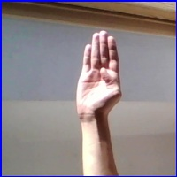
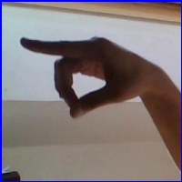
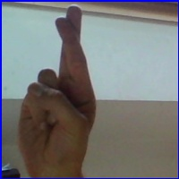
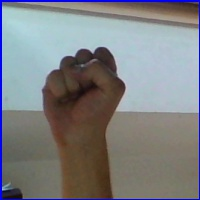
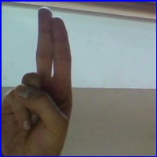
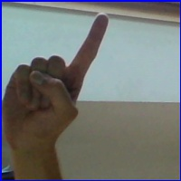

# Fastai ASL Classification WebGL Demo
An American Sign Language (ASL) classifier WebGL demo for the fastai to Unity tutorial

**Live Demo:** [https://cj-mills.github.io/Fastai-ASL-Classification-WebGL-Demo/](https://cj-mills.github.io/Fastai-ASL-Classification-WebGL-Demo/) 

### Kaggle Dataset: [belalelwikel/asl-and-some-words](https://www.kaggle.com/datasets/belalelwikel/asl-and-some-words)

<h3>

Reference Images
 
| Label    | Image                                              |
| --------- | ------------------------------------------------------------ |
| 0_OR_O    |  |
| 1         |  |
| 2_OR_V    |  |
| 3         |  |
| 4         |  |
| 5         |  |
| 6_OR_W    |  |
| 7         |  |
| 8         |  |
| 9         |  |
| A         |  |
| B         |  |
| C         |  |
| D         |  |
| E         |  |
| F         |  |
| G         |  |
| H         |  |
| I         |  |
| J         |  |
| K         |  |
| L         |  |
| M         |  |
| N         |  |
| O_OR_0    |  |
| P         |  |
| Q         |  |
| R         |  |
| S         |  |
| T         |  |
| U         |  |
| V_OR_2    |  |
| W_OR_6    |  |
| X         |  |
| Y         |  |
| Z         |  |
| Baby      |  |
| Brother   |  |
| Dont_Like |  |
| Friend    |  |
| Help      |  |
| House     |  |
| Like      |  |
| Love      |  |
| Make      |  |
| More      |  |
| Name      |  |
| No        |  |
| Pay       |  |
| Play      |  |
| Stop      |  |
| With      |  |
| Yes       |  |
| nothing   |  |

</h3>
